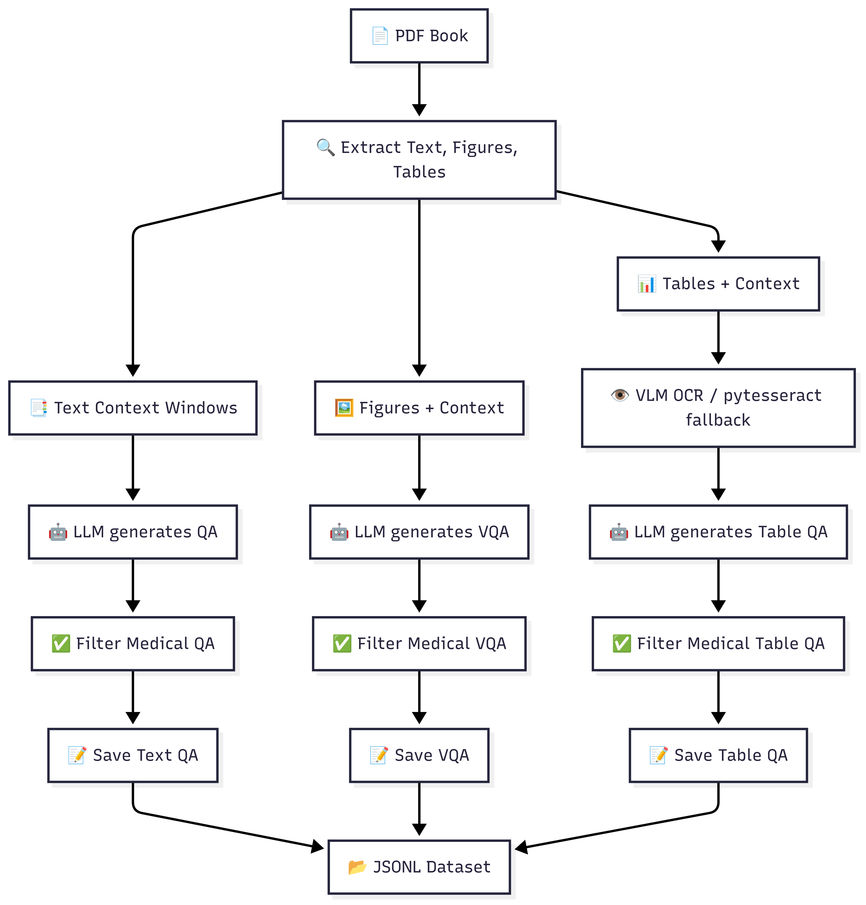

# VQA from Book - Cataract Surgery Data Generation Pipeline


## Overview
This project provides a robust pipeline for generating Question-Answer (QA), Visual Question-Answer (VQA), and Table QA data from medical textbooks in PDF format, specifically focused on Cataract Surgery. The script processes PDF books, extracts text, figures, and tables, and uses large language models (LLMs) and vision-language models (VLMs) to generate high-quality Q&A pairs for research and training purposes.

## Pipeline Flowchart

*Figure: Flowchart of the VQA/QA data generation pipeline.*

## Features
- Extracts text, figures, and tables from PDF textbooks
- Generates general and visual Q&A pairs using LLMs and VLMs
- Performs OCR on tables and figures for QA generation
- Saves results as CSV and JSONL files for downstream use
- Modular and configurable workflow

## Requirements
- Python 3.8 or higher
- CUDA-capable GPU recommended for faster model inference
- System dependencies:
  - Tesseract OCR (optional, for table OCR fallback)
  - Required disk space: At least 10GB for models and generated data

### System Dependencies Installation

#### Ubuntu/Debian
```bash
# Install Tesseract OCR (optional)
sudo apt-get update
sudo apt-get install -y tesseract-ocr

# Install Python development tools
sudo apt-get install -y python3-pip python3-dev
```

#### macOS
```bash
# Using Homebrew
brew install tesseract
brew install python@3.8
```

#### Windows
1. Install Python 3.8+ from [python.org](https://www.python.org/downloads/)
2. (Optional) Install Tesseract OCR:
   - Download installer from [UB Mannheim](https://github.com/UB-Mannheim/tesseract/wiki)
   - Add Tesseract to system PATH

### Python Environment Setup

1. Create and activate a virtual environment:
```bash
python -m venv venv
source venv/bin/activate  # On Windows: venv\Scripts\activate
```

2. Install required Python packages:
```bash
pip install -r requirements.txt
```

### Required Python Packages
```
PyMuPDF==1.23.8  # PDF processing
Pillow==10.2.0   # Image processing
pytesseract==0.3.10  # OCR fallback (optional)
pandas==2.2.0    # Data handling
langchain==0.1.0  # LLM orchestration
langchain-core==0.1.18
langgraph==0.0.19
langchain-community==0.0.13
langchain-experimental==0.0.49
pydantic==2.6.1
```

## Installation

1. Clone the repository:
```bash
git clone https://github.com/shahedmomenzadeh/QA_VQA_generation_from_pdf.git
cd QA_VQA_generation_from_pdf
```

2. Set up the Python environment as described above.

3. Prepare the directory structure:
```bash
mkdir -p Books output
```

4. Configure Models:
- The script uses [ChatOllama](https://github.com/ollama/ollama) for inference
- Install Ollama following instructions at [ollama.ai](https://ollama.ai)
- Pull required models:
```bash
ollama pull gemma3:12b
ollama pull granite3.2-vision:2b
```

## Directory Structure
```
QA_VQA_generation_from_pdf/
├── Books/                  # Place your PDF books here
├── output/                 # Generated data will be saved here
│   ├── images/            # Extracted images
│   └── tables/            # Extracted tables
├── VQA_from_book.py       # Main script
└── requirements.txt       # Python dependencies
```

## Usage
1. Place your PDF books in the `Books/` directory.

2. Configure the script (optional):
   - Open `VQA_from_book.py`
   - Modify the `Config` class:
     ```python
     class Config:
         RUN_TEXT_QA = True    # Enable/disable text QA
         RUN_VQA = True        # Enable/disable visual QA
         RUN_TABLE_QA = True   # Enable/disable table QA
         LLM_MODEL = "gemma3:12b"
         VLM_MODEL = "granite3.2-vision:2b"
     ```

3. Run the script:
```bash
python VQA_from_book.py
```

### Output Files
For each processed book, the script generates:
- `output/<book_name>/qa_pairs.csv` and `.jsonl`: Text and table QA pairs
- `output/<book_name>/vqa_pairs.csv` and `.jsonl`: Visual QA pairs
- `output/<book_name>/images/`: Extracted figures
- `output/<book_name>/tables/`: Extracted tables

## Troubleshooting

### Common Issues

1. Model Loading Errors:
```bash
# Verify Ollama is running
ollama list

# Check model availability
ollama pull gemma3:12b
ollama pull granite3.2-vision:2b
```

2. OCR Issues:
```bash
# Verify Tesseract installation
tesseract --version

# On Windows, check PATH environment variable
echo %PATH%
```

3. Memory Issues:
- Reduce batch size or process fewer images simultaneously
- Use a machine with more RAM
- Enable swap space

### Error Messages

1. "Model not found":
   - Ensure Ollama is installed and running
   - Pull the required models manually

2. "OCR Failed":
   - Check Tesseract installation
   - Verify image quality
   - Try upgrading Tesseract

3. "CUDA out of memory":
   - Reduce model size
   - Process fewer items simultaneously
   - Use CPU fallback

## License
Do whatever you want with it.

## Citation
If you use this pipeline in your research, please cite:
```bibtex
@software{momenzadeh2024vqa,
  author = {Momenzadeh, Shahed},
  title = {QA VQA Generation from PDF},
  year = {2024},
  publisher = {GitHub},
  url = {https://github.com/shahedmomenzadeh/QA_VQA_generation_from_pdf}
}
```
